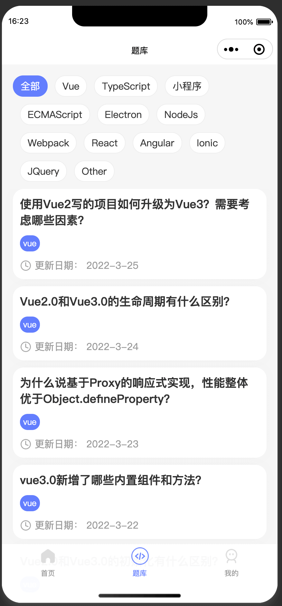
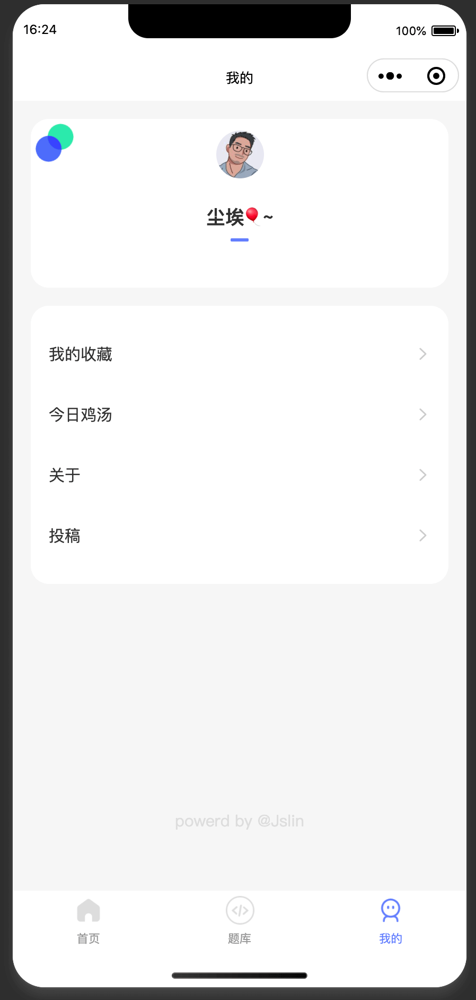
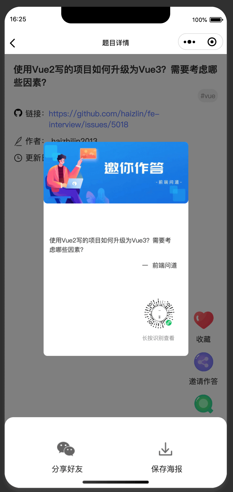
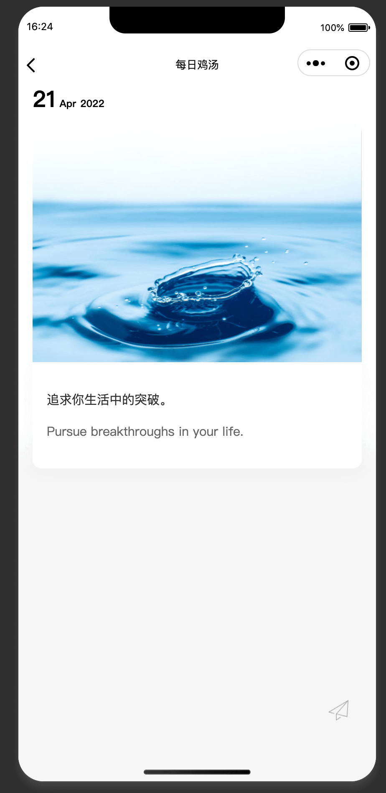

<p align="center">
    
</p>

<h1 align="center">前端问道 小程序</h1>

<div align="center">
    <span>前端问道 小程序</span><br/>
    <strong>一个前端知识仓库小程序</strong>
</div>

# 前端问道小程序
 小程序里的资源来源于  [前端面试3+1 ](http://www.h-camel.com/index.html)  
 每日鸡汤数据来源于  [爱词霸](http://open.iciba.com/dsapi/)
 此项目在你学习前端的同时，也是你学习开发小程序的Demo


## 功能介绍
 -  首页（展示今日题目，分类，热门题目等）
 -  题库 （展示所有分类下的题目）
 -  我的 （个人信息墙）


## 功能截图
<div align="center">
    
    
    
    
    
    
    
    
</div>
 
 
 ## 每日鸡汤 开放api:
```
title = YYYY-MM-DD 日期格式的日期
https://sentence.iciba.com/index.php?c=dailysentence&m=getdetail&title=${title}
```
##  爱词霸每日一句API介绍

调用地址：`http://open.iciba.com/dsapi/`  
请求方式：GET  
请求参数：  

| 参数 | 必选 | 类型   | 说明                                                                               |
| ---- | ---- | ------ | ---------------------------------------------------------------------------------- |
| date | 否   | string | 格式为：`2013-05-06`；如果`date`为空，则默认取当天                                 |
| type | 否   | string | 可选值为`last`和`next`；以`date`日期为准的，`last`返回前一天的，`next`返回后一天的 |

返回类型：JSON  
JSON字段解释：  

| 属性名       | 属性值类型 | 说明                       |
| ------------ | ---------- | -------------------------- |
| sid          | string     | 每日一句ID                 |
| tts          | string     | 音频地址                   |
| content      | string     | 英文内容                   |
| note         | string     | 中文内容                   |
| love         | string     | 每日一句喜欢个数           |
| translation  | string     | 词霸小编                   |
| picture      | string     | 图片地址                   |
| picture2     | string     | 大图片地址                 |
| caption      | string     | 标题                       |
| dateline     | string     | 时间                       |
| s_pv         | string     | 浏览数                     |
| sp_pv        | string     | 语音评测浏览数             |
| tags         | array      | 相关标签                   |
| fenxiang_img | string     | 合成图片，建议分享微博用的 |


正常返回示例：
``` json
{
  "sid": "3080",
  "tts": "http://news.iciba.com/admin/tts/2018-08-01-day.mp3",
  "content": "No matter how hard we try to be mature, we will always be a kid when we all get hurt and cry. ",
  "note": "不管多努力蜕变成熟，一旦受伤哭泣时，我们还是像个孩子。",
  "love": "1966",
  "translation": "小编的话：这句话出自小说《彼得·潘》。岁月永远年轻，我们慢慢老去。不管你如何蜕变，最后你会发现：童心未泯，是一件值得骄傲的事情。长大有时很简单，但凡事都能抱着一颗童心去快乐享受却未必容易。",
  "picture": "http://cdn.iciba.com/news/word/20180801.jpg",
  "picture2": "http://cdn.iciba.com/news/word/big_20180801b.jpg",
  "caption": "词霸每日一句",
  "dateline": "2018-08-01",
  "s_pv": "0",
  "sp_pv": "0",
  "tags": [
    {
      "id": null,
      "name": null
    }
  ],
  "fenxiang_img": "http://cdn.iciba.com/web/news/longweibo/imag/2018-08-01.jpg"
}
```  
请求示例：http://open.iciba.com/dsapi/?date=2013-05-03


